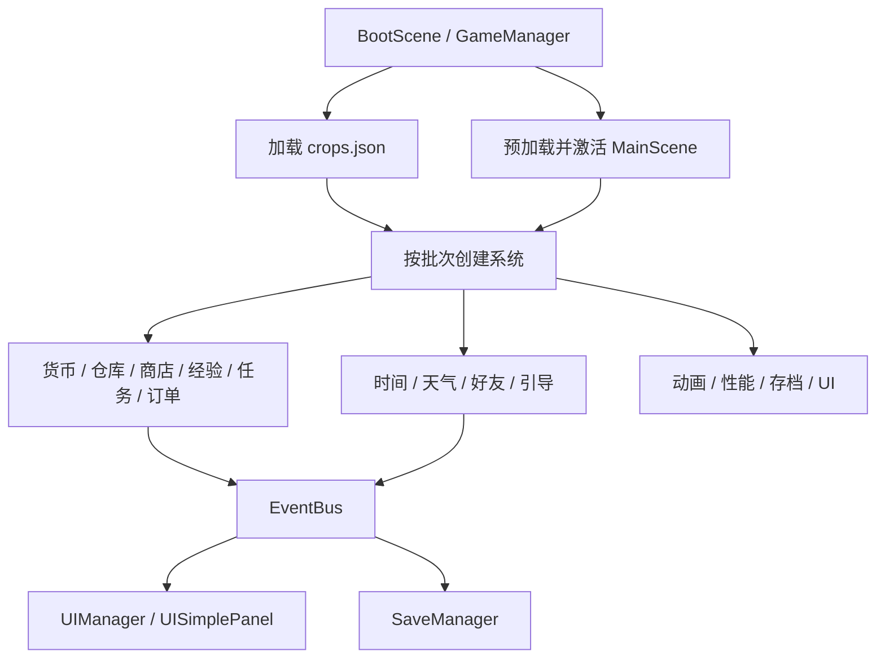

# FarmCreator 实现教程

本文面向希望学习 Cocos Creator 3.x、TypeScript、瓦片地图和事件驱动游戏架构的读者。内容只介绍 `FarmCreator`，不涉及仓库中的 C++ 工程。

项目当前使用 Cocos Creator 3.8.8。它不是完整商业游戏，而是一个可以继续拆解、修改和扩展的农场玩法示例。

## 1. 如何打开和运行

1. 启动 Cocos Dashboard。
2. 使用 Cocos Creator 3.8.8 打开 `FarmCreator`。
3. 等待资源数据库完成导入。
4. 在资源管理器中双击 `BootScene.scene`。
5. 将预览平台选为“浏览器”。
6. 取消勾选“Show FPS”，以免调试信息遮挡游戏界面。
7. 按 `Ctrl + P`，或点击编辑器顶部的预览按钮。

必须从 `BootScene` 开始预览。`BootScene` 中的 `GameManager` 会加载作物配置、预加载 `MainScene`，并按依赖顺序创建各个游戏系统。如果直接预览 `MainScene`，这段完整启动流程不会执行。

建议使用 `1024 × 768` 的横屏预览尺寸。项目的设计分辨率也是 `1024 × 768`，便于观察瓦片坐标、动态面板和场景节点之间的关系。

## 2. 目录结构

```text
FarmCreator/
├─ assets/
│  ├─ BootScene.scene              # 极简启动场景
│  ├─ MainScene.scene              # 农场主场景
│  ├─ resources/
│  │  ├─ data/crops.json           # 作物、价格和生命周期配置
│  │  ├─ map/farm.tmx              # Tiled 地图
│  │  ├─ crop/                     # 作物图集
│  │  ├─ farmUI/                   # 农场 UI 图集
│  │  ├─ effect/                   # 飞鸟等效果资源
│  │  └─ audio/                    # 背景音乐和操作音效
│  └─ ts/
│     ├─ GameManager.ts            # 启动和系统编排
│     ├─ Crop.ts                   # 作物数据、状态和生长
│     ├─ soil.ts                   # 土地、坐标、扩建和播种
│     ├─ EventBus.ts               # 全局事件总线
│     ├─ UIManager.ts              # 面板生命周期管理
│     ├─ UISimplePanel.ts          # 商店、仓库和存档动态 UI
│     └─ *Manager.ts / *System.ts  # 各独立功能系统
├─ package.json
└─ tsconfig.json
```

放在 `assets/resources` 下的资源可以通过 `resources.load()` 使用不带扩展名的相对路径加载。例如：

```ts
resources.load('data/crops', JsonAsset, callback);
resources.load('crop/crop', SpriteAtlas, callback);
```

## 3. 整体架构

项目采用“场景负责展示、Manager 负责状态、EventBus 负责通知”的结构。



这种拆分有三个好处：

- `CropNode` 不需要知道任务、成就和存档如何实现。
- 商店、仓库和订单可以独立测试。
- 新增玩法时通常只需要订阅已有事件，不必修改原始模块。

## 4. 启动流程

入口是 `GameManager.onLoad()`。

### 4.1 为什么使用常驻根节点

`GameManager` 位于 `BootScene`。切换到 `MainScene` 时，普通节点会跟随旧场景销毁，所以需要调用：

```ts
game.addPersistRootNode(this.node);
```

只有场景的直接子节点可以成为常驻节点，因此不要把 `GameManager` 随意移动到深层节点。

### 4.2 场景和数据并行加载

主场景与作物 JSON 互不依赖，代码使用 `Promise.all()` 并行等待：

```ts
const sceneReady = this._preloadAndLaunchMainScene();
await Promise.all([this.initialize(), sceneReady]);
```

`preloadScene()` 负责加载进度，`loadScene()` 负责真正激活场景。Creator 3.8 中不要把 `loadScene()` 的回调误当作进度回调。

### 4.3 分帧创建系统

系统没有一次性全部创建，而是拆为四批：

1. 时间、天气、好友和引导。
2. 货币、仓库、商店、经验、任务、成就和订单。
3. 性能与动画。
4. 存档与 UI。

每批之间通过 `scheduleOnce()` 让出一帧。这样加载界面和渲染线程仍有机会更新，也能明确控制依赖顺序。

## 5. 作物配置与反序列化

作物定义位于 `assets/resources/data/crops.json`。单项结构如下：

```json
{
  "name": "白萝卜",
  "id": 101,
  "matureTimes": 1,
  "tempLow": 2,
  "tempHigh": 25,
  "seedPrice": 5,
  "sellPrice": 12,
  "lifecycle": [
    {
      "name": "种子期",
      "fuel": 0,
      "water": 1,
      "time": 3
    }
  ]
}
```

字段含义：

- `id`：作物唯一编号，也是查找图集帧的依据。
- `matureTimes`：成熟后可以收获的次数。
- `tempLow`、`tempHigh`：适宜温度范围。
- `seedPrice`：种子价格。
- `sellPrice`：收获物的基础售价。
- `lifecycle`：生长阶段及每个阶段所需的游戏时间。

`CropData.deserializeAll()` 会先把全部 JSON 解析到临时数组，所有项目都成功后才替换 `CropData.AllCrops`。这样某个配置出错时不会留下“前几种作物可用、后几种不可用”的半加载状态。

### 新增一种作物

1. 在 `crops.json` 中增加一个唯一 `id`。
2. 在作物图集中加入对应阶段图片。
3. 图片帧命名为 `crop_<id>_01`、`crop_<id>_02` 等。
4. 如需修改商店解锁规则，调整 `ShopManager.calculateUnlockLevel()`。
5. 从 `BootScene` 重新预览，观察控制台中的作物加载数量。

## 6. 作物生命周期

`CropNode` 继承自 `Node`，每一株作物都是一个带 `Sprite` 和 `Button` 的节点。

主要状态包括：

```text
Seed → Seeding → Growing → Flowering → Fructifying → Mature → Dead
```

`Soil.update()` 每帧调用每株作物的 `onGrowing()`。生长判断包含：

- 当前是否已经死亡。
- 水分、养料和温度是否合适。
- 是否存在虫害。
- 当前阶段经过的时间是否达到要求。
- 天气系统提供的生长倍率。

现实时间与游戏时间的换算集中在：

```ts
Common.RealTimeToGameTime(day);
```

教程调试时可以提高换算速度，让几分钟甚至几秒内观察到完整生命周期。正式玩法应把换算倍率放进独立配置，而不是散落在作物代码中。

成熟作物被点击后：

1. 播放收获音效。
2. 调用 `WarehouseManager.storeCrop()`。
3. 发送 `CROP_HARVESTED`。
4. 任务、成就和存档系统各自收到通知。
5. 根据 `matureTimes` 决定重新生长还是进入枯萎状态。

## 7. Tiled 地图与坐标转换

土地来自 `farm.tmx`。`Soil` 同时保存：

- `TiledMap`：整张地图。
- `TiledLayer`：土地瓦片层。
- `TiledObjectGroup`：对象参考层。
- `SpriteAtlas`：作物图片。

屏幕点击位置首先通过 `UITransform.convertToNodeSpaceAR()` 转换为地图节点局部坐标，再使用等距地图公式计算瓦片坐标：

```ts
const tileX = Math.floor((layerHeight - y + x) / 2);
const tileY = Math.floor((layerHeight - y - x) / 2);
```

反向放置作物时不再自行硬编码斜率，而是调用：

```ts
const tilePos = soilLayer.getPositionAt(tileX, tileY);
cropNode.setPosition(tilePos.x - OffsetX, tilePos.y - OffsetY);
```

`OffsetX` 和 `OffsetY` 用来补偿 TiledMap 内容尺寸与瓦片原点之间的差异。

### 土地扩建

扩建牌记录当前待开放的 `(x, y)`。点击后：

1. 将对应瓦片 GID 改为可耕种土地。
2. 优先检查商店中选中的种子。
3. 有已购买种子时扣除一颗并播种。
4. 没有库存时使用原有随机播种逻辑。
5. 横向移动扩建牌，到行尾后进入下一行。

## 8. 事件总线

全局实例为：

```ts
export const eventBus = new EventBus();
```

发送事件：

```ts
eventBus.emit(GameEvent.CROP_HARVESTED, {
  cropId,
  cropName,
  tile: { x, y }
});
```

订阅和注销必须成对出现：

```ts
onLoad() {
  eventBus.on(GameEvent.CROP_HARVESTED, this.onHarvested, this);
}

onDestroy() {
  eventBus.off(GameEvent.CROP_HARVESTED, this.onHarvested, this);
}
```

最后一个 `this` 是监听目标。它让同一个方法在不同组件实例上可以独立注销。

调试模式会保存最近 100 条事件历史并输出控制台日志；非调试环境不记录历史，减少运行时分配。

## 9. 商店、仓库与订单

### 9.1 商店

`ShopManager` 从同一份 `crops.json` 生成商品，因此作物名称、成熟时间和价格不需要维护两套。

购买流程：

1. 检查商品是否存在并已解锁。
2. 检查数量是否为正整数。
3. 让 `CurrencySystem` 判断金币是否足够。
4. 扣除金币。
5. 增加种子库存并设为优先种子。
6. 发送 `SHOP_ITEM_BOUGHT`。

如果读档发生在商品 JSON 完成加载之前，存档内容会放入 `_pendingSaveData`，等商品表准备好后再恢复，避免异步时序覆盖有效库存。

### 9.2 仓库

仓库使用：

```ts
Map<number, WarehouseItem>
```

作物编号是键，因此查找和增减库存都是常数时间操作。对外恢复存档时会复制数据并过滤负数、非整数和错误结构，避免外部对象继续修改仓库内部状态。

### 9.3 订单

`MarketOrderManager` 生成当前订单。交付时调用仓库的 `removeCrop()`，它只扣库存、不按普通售价结算，再由订单系统发放额外金币和经验。

这种设计把“库存变化”和“奖励规则”分离，可以继续增加：

- 限时订单。
- 连续交付奖励。
- 稀有作物加价。
- 不同 NPC 的偏好。

## 10. 动态 UI 的实现

`UISimplePanel` 没有依赖多个大型 Prefab，而是用代码创建：

- 木质外框和羊皮纸背景。
- 标题、货币和等级区域。
- 分类按钮。
- `ScrollView`、`Mask` 和 `Layout`。
- 商品卡片、库存卡片和订单卡片。
- 购买、出售数量弹窗。

这种写法适合教学，因为节点层级和组件创建过程都能在同一个文件中看到。大型正式项目仍建议把稳定结构拆为 Prefab，以便美术和策划直接调整。

### 作物图标为什么要有安全区

卡片顶部是名称，底部是价格或库存。不同作物原图的枝叶高度差异很大，如果图片直接占满卡片就会遮挡文字。

项目将尺寸集中为：

```ts
CARD_CROP_W
CARD_CROP_H
ORDER_CROP_W
ORDER_CROP_H
DETAIL_CROP_W
DETAIL_CROP_H
```

所有作物图片只能放在标题与底部信息之间。`findCropFrame()` 还会缓存“作物编号到成熟帧”的映射，列表刷新时无需重复遍历图集。

### 面板关闭竞态

关闭动画是异步的。如果先播放动画、最后才清空面板引用，用户快速点击时可能创建新面板，而旧回调又销毁错误节点。

`UIManager` 的处理顺序是：

1. 保存旧节点。
2. 立即清空 `currentXxxPanel`。
3. 对旧节点播放关闭动画。
4. 动画结束后只销毁旧节点。

## 11. 存档系统

`SaveManager` 支持三个本地槽位：

```text
farm_save_0
farm_save_1
farm_save_2
```

每个槽位还有一个轻量元数据键：

```text
farm_save_0_meta
```

面板显示存档列表时只解析元数据，不需要读取完整农场数据。

保存内容包括：

- 玩家金币、等级和经验。
- 仓库、种子与已解锁商品。
- 市场订单。
- 农田中每株作物的位置和生长进度。
- 扩建牌位置。
- 时间、天气、好友、任务、成就和引导。
- 游戏时长及设置。

### 为什么要做事件防抖

一次购买可能同时产生金币变化、种子变化和商店购买事件。如果每条事件都立即写一次 `localStorage`，同一操作会重复保存多次。

项目使用两秒延迟：

```text
第一次数据事件
  → 标记待保存
  → 两秒内继续合并事件
  → 最终只执行一次 save()
```

同时每分钟仍有一次兜底自动存档。

### 存档安全

- 槽位必须是 `0` 到 `2` 的整数。
- 解析失败会返回错误，不覆盖当前状态。
- 非核心设置损坏时只忽略设置，不让整个存档失败。
- 导入、导出接口使用 Base64，主要用于教学演示，不等同于加密。

## 12. 动画和环境效果

### 飘云

`cloud.ts` 使用 Tween 改变节点位置。常见循环写法是：

```ts
tween(node)
  .to(duration, { position: target })
  .call(resetPosition)
  .union()
  .repeatForever()
  .start();
```

### 飞鸟

飞鸟图集和动画在主场景可交互后延迟加载：

1. 加载 `effect/bird/bird` 图集。
2. 加载 `animation/bird` 动画剪辑。
3. 播放逐帧动画。
4. 通过 Tween 让节点横穿屏幕并循环。

延迟加载可以避免 155 帧飞鸟资源阻塞首屏。

### 烟花

烟花属于点击触发效果。`fireworks.ts` 和 `brand.ts` 负责在交互发生时加载或播放动画，同时调用音频控制器。

### 天气

`WeatherSystem` 提供天气状态和 `growthMultiplier`。作物实际阶段时间除以倍率：

```ts
adjustedTime = baseTime / growthMultiplier;
```

倍率大于 `1` 时生长更快，小于 `1` 时更慢。

## 13. 音频

音频资源位于 `assets/resources/audio`：

- `bg.mp3`：背景音乐。
- `click.mp3`：普通点击。
- `gather.mp3`：收获。
- `extand.mp3`：扩建。
- `fireworks.mp3`：烟花。
- `wipe.mp3`：铲除枯萎作物。

浏览器通常禁止页面在没有用户交互时自动播放声音。因此第一次预览无音乐时，先点击一次游戏画面，这不是项目加载失败。

## 14. 如何增加一个新面板

推荐步骤：

1. 在 `UIManager` 中增加当前面板引用。
2. 创建 `openXxxPanel()` 和 `closeXxxPanel()`。
3. 让关闭逻辑复用 `destroyPanelWithAnimation()`。
4. 新面板在 `onLoad()` 中注册事件。
5. 在 `onDestroy()` 中注销完全相同的事件。
6. 数据变化通过 Manager 和 EventBus 传递，不直接访问其他面板节点。

如果面板结构复杂且需要频繁美术调整，优先使用 Prefab；如果目标是展示 API 和节点创建过程，可以沿用 `UISimplePanel` 的动态方式。

## 15. 调试建议

### 查看启动阶段

过滤控制台中的：

```text
[GameManager]
```

可以看到场景预加载、配置解析、系统创建和延迟资源加载耗时。

### 查看事件流

调试模式下过滤：

```text
[EventBus]
```

可以观察一次收获或购买引发了哪些后续事件。

### 查看本地存档

浏览器开发者工具中打开 Application → Local Storage，搜索：

```text
farm_
```

删除这些键可以模拟新玩家，但操作前应先导出需要保留的存档。

### 常见问题

**只有空场景或没有系统日志**

确认预览的是 `BootScene`，不是直接预览 `MainScene`。

**商店显示“数据正在加载”**

查看 `resources/data/crops.json` 是否能被导入，控制台是否出现配置格式错误。

**作物不显示**

检查 SpriteAtlas 中的帧命名是否与 `crop_<id>_0<stage>` 一致。

**点击位置与瓦片错位**

检查 Tiled 地图尺寸、瓦片尺寸、地图节点锚点，以及 `OffsetX`、`OffsetY` 的计算。

**浏览器里没有声音**

先点击一次游戏画面，允许浏览器恢复音频上下文。

## 16. 适合作为练习的扩展

可以按难度继续实现：

1. 给 `crops.json` 增加配置校验和编辑器工具。
2. 将动态面板拆成可复用卡片 Prefab。
3. 为作物生长、商店购买和订单交付增加自动化测试。
4. 把时间倍率、初始金币、订单刷新时间移到独立游戏配置。
5. 增加浇水、施肥、除虫等土地状态。
6. 增加离线生长结算。
7. 增加存档版本迁移测试。
8. 增加资源释放策略和对象池统计面板。

建议一次只选择一个扩展，先写清数据归属和事件，再开始增加 UI。这样更容易保持各系统之间的边界。
