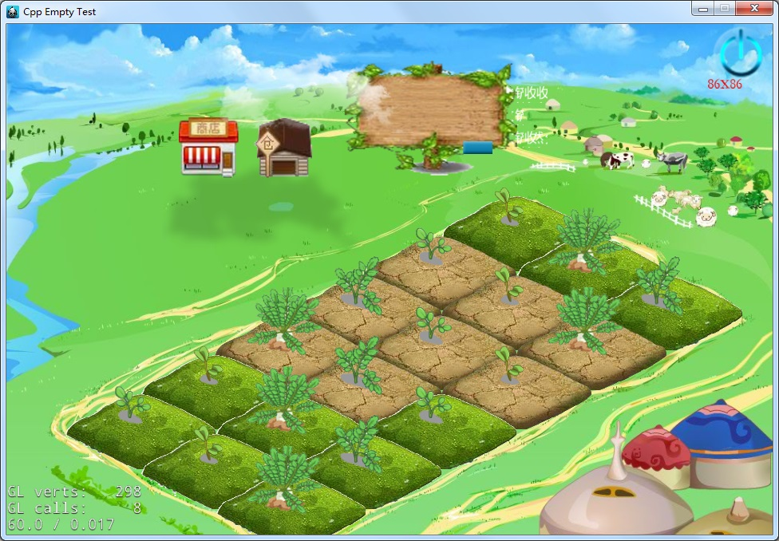
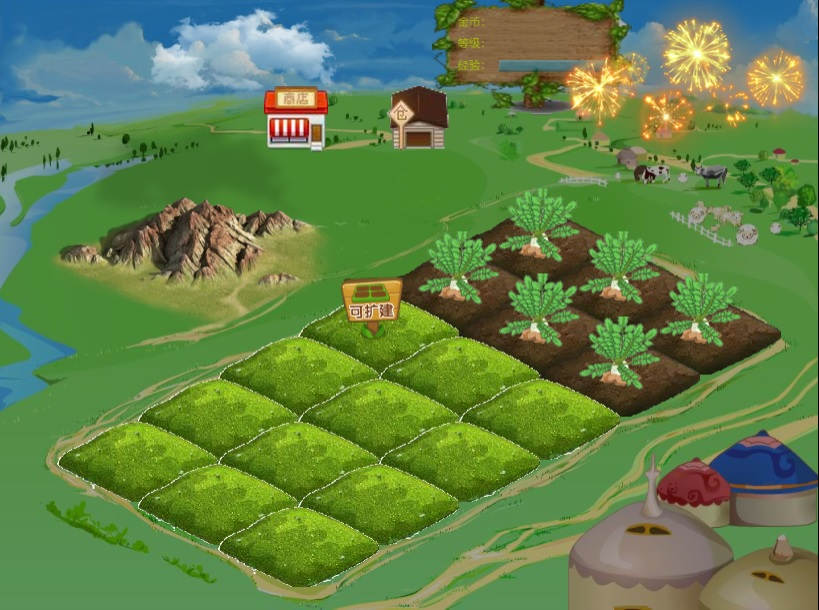

# Farm
cocos制作的农场游戏demo源码 一个cocos2dxC++版本 一个cocos creator版本

我不是搞这行的，所以出了demo就不打算搞下去了，没意思，发出来给有兴趣的人参考吧。写了一些总结，权当参考：[cocos编写农场偷菜小游戏的总结](https://blog.csdn.net/asmcvc/article/details/105641708)

## C++版本
碎图及资源文件摘自[SDL农场游戏开发](https://github.com/sky94520/Farm/tree/Farm-09)，这个因为是作者使用的自己编写的SDL_Engine游戏引擎，不方便学习，更重要也不能直接编译运行，所以需要迁移到cocos。
因为他的工程代码是C++的，所以就使用了cocos2dxC++版本创建的项目，使用的是4.0版本的cocos2dx，需要自行下载编译，然后直接拿cpp-empty-test工程修改的，好在代码风格差不多，所以迁移还算顺利。

效果图：

## Cocos Creator版本

虽然Cocos Creator的模式很好，但是工具是做得一塌糊涂，这家伙感觉迟早药丸，好在是开源的，估计国内有志之士肯定改了很多版本，改稳定了就自己用就行了，2D游戏足够了。

网上看了一些帖子，看创始人的意思是Creator定位是H5小游戏，再一次确定完蛋是迟早的，建议未入门的没必要再入坑了。

也有好的方面，Creator的快速UI设计能力真的很强劲，可以分分钟快速出成品，就是BUG太多，动不动没响应卡死。然后就是代码的选取，因为定位是H5小游戏，所以很自然就选取了JavaScript，我个人很不喜欢JavaScript所以不做评价。
好在支持了TypeScript，但仍然不够，代码编辑器选取的是VSCode也是不给力，跟VisualStudio、IDEA等差得太远了，但还算说得过去。

效果图：

测试发现，用了更新的版本Cocos Creator2.3.3打开工程发现UI什么的都错位了，这也是网上大部分开发者吐槽的问题，一堆问题，新老版本不兼容，吃枣药丸。

# 其他
## 工具
- [老版本cocos-studio-下载](https://github.com/fusijie/Cocos-Resource#cocos-studio-%E4%B8%8B%E8%BD%BD)
- 瓦片地图编辑：Tiled Map Editor
- 合图工具：TexturePacker
- 碎图工具：TextureUnpacker

## 参考
- https://github.com/sky94520/Farm/tree/Farm-09
- https://github.com/kryvytskyidenys/Flower-farm
- https://github.com/cocos56/coocs2d-x_C-_Demos
- [SDL农场游戏开发](https://blog.csdn.net/bull521/category_7534900.html)
- [cocos2dx 植物大战僵尸](https://blog.csdn.net/bull521/category_6524913.html)
- [pasture：一款cocos-creator创建的农场游戏](https://github.com/shockingsrose/pasture)
