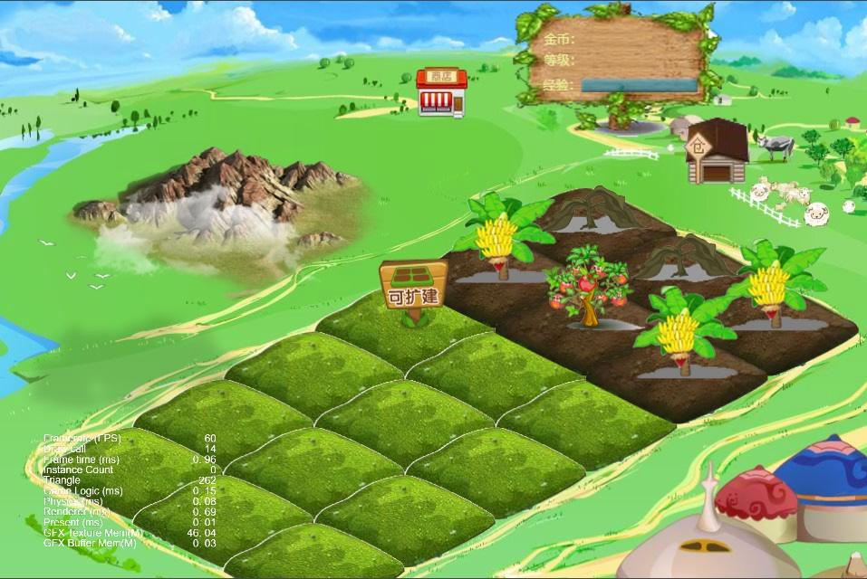

# Farm🌱

`cocos`制作的农场游戏`demo`源码 一个`cocos2dx`C++版本一个`cocos creator`版本，Cocos Creator编辑器的使用可以记录在这里：[Cocos Creator使用汇总备查](https://zhupite.com/program/cocos-creator-summary.html)，不会用的可以参考。

我不是搞这行的，所以出了demo就不打算搞下去了，发出来给有兴趣的人参考吧。写了一些总结，权当参考：[cocos编写农场偷菜小游戏的总结](https://blog.csdn.net/asmcvc/article/details/105641708)

碎图及资源文件有一部分使用了[SDL农场游戏开发](https://github.com/sky94520/Farm/tree/Farm-09)里的资源，有一部分是从老版本的率土之滨里扒出来的资源，以上资源均用于学习研究使用，如果侵权请告知，会在第一时间删除。

## Cocos Creator版本

**2025-05-20：**

- 升级到`Cocos Creator 3.8.6`版本

**2025-03-25：**

- 升级到`Cocos Creator 3.8.5`版本
- 解决坐标偏移硬编码的问题

**2023-12-7：**

- 已升级到`3.8.1`版本，亲测启动速度快了很多。
- 增加背景音乐和音效。
- 作物成熟期间可以手工点击采摘，超时自动采摘并进入下一生长周期。

**2023-11-28：**

- 通过硬编码纠正了坐标，后面需要继续研究`Tilemap`的坐标自动适配，这点感觉非常不好，`Cocos Creator`应该提供接口直接使用。
- 启动时初始化 2 行土地，并自动随机种植作物。
- 点击「扩展牌」可以扩展新的土地，并自动随机种植作物。
- 增加作物配置`json`文件，见：`resources/data/crops.json`。
- 作物自动生长，为方便测试加快了速度，并实现个别作物多年生一直生长。

**2023年4月2日补充**：

上次使用新版本转换后的工程一堆问题，调整花费时间较长，索性新建工程重新实现，发现速度还快一些，这也间接说明新老版本的兼容及转换问题真是令人头疼。增加了飞鸟动画，目前动画效果有：飘云、烟花、飞鸟。瓦块地图的坐标转换这块搞不清楚，问了ChatGPT给的方案也不行，多次试了效果不理想，其实`Cocos Creator`完全可以封装好接口。有空再看吧。

**2023年3月31日补充**：

已经转换成了`Cocos Creator 3.7.2`版本，解决了部分因为版本不同导致的问题，可以运行，能出一部分效果，但是还有一些问题，等以后有问题了再看。再说下感受：

1. 版本之间兼容很差，虽然官网提供了插件进行转换（[cocos/cocos-plugin-import-2.x: plugin for migrating cocos creator 2.x projects.](https://github.com/cocos/cocos-plugin-import-2.x)）但还是会有很多问题的，需要手动修改，所幸是有ChatGPT，否则我是没动力。
2. 编辑器的使用有一些变化，没之前好用，之前看过教程会用了，现在升级到新版本又不会用了。
3. 编辑器的使用有点反人类，各种拖动箭头什么的，使用上非常不人性化，超级难用，各种BUG和问题。
4. 好的方面：3D里面直接支持2D的这个思路还挺好的。

**之前的记录（2021年）**：

Cocos Creator的快速UI设计能力真的很强劲，可以分分钟快速出成品，就是BUG太多，动不动没响应卡死。然后就是代码的选取，因为定位是H5小游戏，所以很自然就选取了JavaScript，个人很不喜欢JavaScript，好在支持了TypeScript。

Cocos Creator的优势在UI设计上，但是痛苦在代码编写上。

效果图：

测试发现，用了更新的版本Cocos Creator2.3.3打开工程发现UI什么的都错位了（之前用的1.9的版本创建的项目），这也是网上大部分开发者吐槽的问题，一堆问题，新老版本不兼容。

后来经过逐个低版本转换升级，目前可以使用Cocos Creator2.4.5打开。

## C++版本

参考了[SDL农场游戏开发](https://github.com/sky94520/Farm/tree/Farm-09)，因为作者是使用的自己编写的SDL_Engine游戏引擎，不方便学习，更重要也不能直接编译运行，所以迁移到cocos2dx。
因为他的工程代码是C++的，所以就使用了cocos2dxC++版本创建的项目，使用的是4.0版本的cocos2dx，需要自行下载编译，然后直接拿cpp-empty-test工程修改的，好在代码风格差不多，所以迁移还算顺利。

C++编写的爽在代码编写，因为新版本的VisualStudio写代码很溜，痛苦在UI设计上。

效果图：

# 工具

- [老版本cocos-studio-下载](https://github.com/fusijie/Cocos-Resource#cocos-studio-%E4%B8%8B%E8%BD%BD)
- 瓦片地图编辑：Tiled Map Editor
- 合图工具：TexturePacker
- 碎图工具：[TextureUnpacker](https://www.onlinedown.net/soft/1114992.htm)

# 参考

**参考了：**

- https://github.com/sky94520/Farm/tree/Farm-09
- [SDL农场游戏开发](https://blog.csdn.net/bull521/category_7534900.html)

**可以参考的：**

- [cocos2dx 植物大战僵尸](https://blog.csdn.net/bull521/category_6524913.html)
- [pasture：一款cocos-creator创建的农场游戏](https://github.com/shockingsrose/pasture)
- [cocos2dx-lua 实现的贪吃蛇游戏项目](https://github.com/doctording/cocos2dx_lua_snake)
